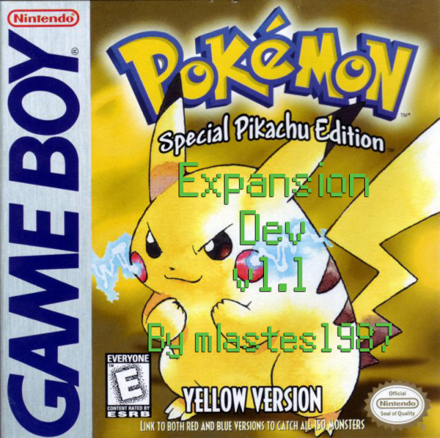
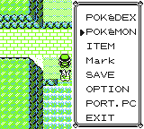
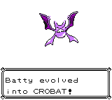
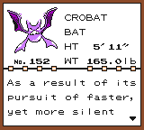
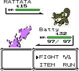

# Pokémon Yellow Expansion Dev

Based on the pokeyellow disassembly by [**Pret**](https://github.com/pret/pokeyellow)

# Features

- **Portable PC** After receiving your Pokedex from Professor Oak, your menu will show a Portable PC option which will allow you, outside of the Elite Four, to access your PC anywhere that isn't your house or Pokemon Center.

- **Bank Expansion** Bank's 1 and 1F and ROMX have been expanded and edited to make room for more stuff.

- **Pikachu learns Surf by HM** This also allows you to participate in the Pikachu Surf minigame.

- **Trade Evolutions** All trade evolutions evolve at level 37.

- **Move Typeset Changes** Fly has been changed to Flying type and Karate Chop is changed to Fighting.

- **Crobat Gen 2 Backport** Crobat has been backported from Pokemon Crystal, sprites and all, evolved from Golbat at level 32, and is able to learn Fly by HM.

- **Known Issues** The back sprite for Crobat is a little rough due to it being shrunk to 32x32 pixels from the Crystal 56x56 so it could fit in the Battle UI.  I'll see what I can do about finding a replacement but it'll do for now.

# Credit/Thanks

Thanks to the [**pret**](https://pret.github.io) community for their help and tutorials which made this project possible.
